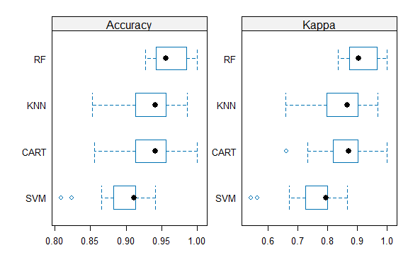
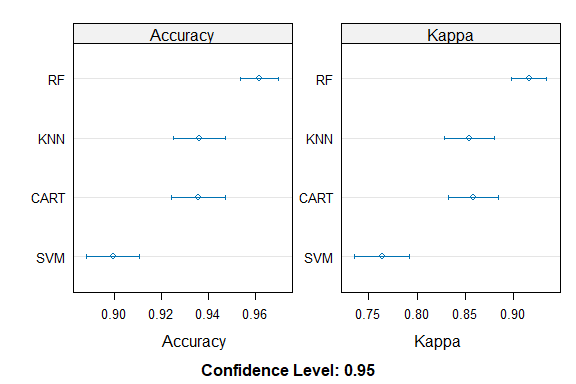
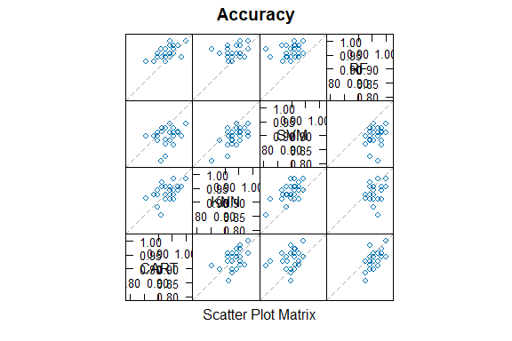

Business Intelligence Lab 8
================
Chicken-nuggets
3rd November 2023

- [Student Details](#student-details)

# Student Details

<table style="width:90%;">
<colgroup>
<col style="width: 45%" />
<col style="width: 44%" />
</colgroup>
<tbody>
<tr class="odd">
<td><strong>Student ID Number and Name</strong></td>
<td><ol type="1">
<li>137118 Fatoumata Camara</li>
<li>127039 Ayan Ahmed</li>
<li>136869 Birkanwal Bhambra</li>
<li>127602 Trevor Anjere</li>
<li>133824 Habiba Siba</li>
</ol></td>
</tr>
<tr class="even">
<td><strong>BBIT 4.2 Group</strong></td>
<td>Chicken-nuggets</td>
</tr>
</tbody>
</table>

``` r
if (require("languageserver")) {
  require("languageserver")
} else {
  install.packages("languageserver", dependencies = TRUE,
                   repos = "https://cloud.r-project.org")
}
```

    ## Loading required package: languageserver

``` r
if (require("mlbench")) {
  require("mlbench")
} else {
  install.packages("mlbench", dependencies = TRUE,
                   repos = "https://cloud.r-project.org")
}
```

    ## Loading required package: mlbench

``` r
## caret
if (require("caret")) {
  require("caret")
} else {
  install.packages("caret", dependencies = TRUE,
                   repos = "https://cloud.r-project.org")
}
```

    ## Loading required package: caret

    ## Loading required package: ggplot2

    ## Loading required package: lattice

``` r
## kernlab 
if (require("kernlab")) {
  require("kernlab")
} else {
  install.packages("kernlab", dependencies = TRUE,
                   repos = "https://cloud.r-project.org")
}
```

    ## Loading required package: kernlab

    ## 
    ## Attaching package: 'kernlab'

    ## The following object is masked from 'package:ggplot2':
    ## 
    ##     alpha

``` r
## randomForest 
if (require("randomForest")) {
  require("randomForest")
} else {
  install.packages("randomForest", dependencies = TRUE,
                   repos = "https://cloud.r-project.org")
}
```

    ## Loading required package: randomForest

    ## randomForest 4.7-1.1

    ## Type rfNews() to see new features/changes/bug fixes.

    ## 
    ## Attaching package: 'randomForest'

    ## The following object is masked from 'package:ggplot2':
    ## 
    ##     margin

``` r
data(BreastCancer)

##removing missing data

BreastCancer <- na.omit(BreastCancer)
```

``` r
train_control <- trainControl(method = "repeatedcv", number = 10, repeats = 3)
```

``` r
set.seed(7)
Class_model_cart <- train(Class ~ ., data = BreastCancer,
                             method = "rpart", trControl = train_control)
```

``` r
set.seed(7)
Class_model_knn <- train(Class ~ ., data = BreastCancer,
                            method = "knn", trControl = train_control)
```

``` r
set.seed(7)
Class_model_svm <- train(Class ~ ., data = BreastCancer,
                            method = "svmRadial", trControl = train_control)
```

    ## Warning in .local(x, ...): Variable(s) `' constant. Cannot scale data.

    ## Warning in .local(x, ...): Variable(s) `' constant. Cannot scale data.

    ## Warning in .local(x, ...): Variable(s) `' constant. Cannot scale data.

    ## Warning in .local(x, ...): Variable(s) `' constant. Cannot scale data.

    ## Warning in .local(x, ...): Variable(s) `' constant. Cannot scale data.

    ## Warning in .local(x, ...): Variable(s) `' constant. Cannot scale data.

    ## Warning in .local(x, ...): Variable(s) `' constant. Cannot scale data.

    ## Warning in .local(x, ...): Variable(s) `' constant. Cannot scale data.

    ## Warning in .local(x, ...): Variable(s) `' constant. Cannot scale data.

    ## Warning in .local(x, ...): Variable(s) `' constant. Cannot scale data.

    ## Warning in .local(x, ...): Variable(s) `' constant. Cannot scale data.

    ## Warning in .local(x, ...): Variable(s) `' constant. Cannot scale data.

    ## Warning in .local(x, ...): Variable(s) `' constant. Cannot scale data.

    ## Warning in .local(x, ...): Variable(s) `' constant. Cannot scale data.

    ## Warning in .local(x, ...): Variable(s) `' constant. Cannot scale data.

    ## Warning in .local(x, ...): Variable(s) `' constant. Cannot scale data.

    ## Warning in .local(x, ...): Variable(s) `' constant. Cannot scale data.

    ## Warning in .local(x, ...): Variable(s) `' constant. Cannot scale data.

    ## Warning in .local(x, ...): Variable(s) `' constant. Cannot scale data.

    ## Warning in .local(x, ...): Variable(s) `' constant. Cannot scale data.

    ## Warning in .local(x, ...): Variable(s) `' constant. Cannot scale data.

    ## Warning in .local(x, ...): Variable(s) `' constant. Cannot scale data.

    ## Warning in .local(x, ...): Variable(s) `' constant. Cannot scale data.

    ## Warning in .local(x, ...): Variable(s) `' constant. Cannot scale data.

    ## Warning in .local(x, ...): Variable(s) `' constant. Cannot scale data.

    ## Warning in .local(x, ...): Variable(s) `' constant. Cannot scale data.

    ## Warning in .local(x, ...): Variable(s) `' constant. Cannot scale data.

    ## Warning in .local(x, ...): Variable(s) `' constant. Cannot scale data.

    ## Warning in .local(x, ...): Variable(s) `' constant. Cannot scale data.

    ## Warning in .local(x, ...): Variable(s) `' constant. Cannot scale data.

    ## Warning in .local(x, ...): Variable(s) `' constant. Cannot scale data.

    ## Warning in .local(x, ...): Variable(s) `' constant. Cannot scale data.

    ## Warning in .local(x, ...): Variable(s) `' constant. Cannot scale data.

    ## Warning in .local(x, ...): Variable(s) `' constant. Cannot scale data.

    ## Warning in .local(x, ...): Variable(s) `' constant. Cannot scale data.

    ## Warning in .local(x, ...): Variable(s) `' constant. Cannot scale data.

    ## Warning in .local(x, ...): Variable(s) `' constant. Cannot scale data.

    ## Warning in .local(x, ...): Variable(s) `' constant. Cannot scale data.

    ## Warning in .local(x, ...): Variable(s) `' constant. Cannot scale data.

    ## Warning in .local(x, ...): Variable(s) `' constant. Cannot scale data.

    ## Warning in .local(x, ...): Variable(s) `' constant. Cannot scale data.

    ## Warning in .local(x, ...): Variable(s) `' constant. Cannot scale data.

    ## Warning in .local(x, ...): Variable(s) `' constant. Cannot scale data.

    ## Warning in .local(x, ...): Variable(s) `' constant. Cannot scale data.

    ## Warning in .local(x, ...): Variable(s) `' constant. Cannot scale data.

    ## Warning in .local(x, ...): Variable(s) `' constant. Cannot scale data.

    ## Warning in .local(x, ...): Variable(s) `' constant. Cannot scale data.

    ## Warning in .local(x, ...): Variable(s) `' constant. Cannot scale data.

    ## Warning in .local(x, ...): Variable(s) `' constant. Cannot scale data.

    ## Warning in .local(x, ...): Variable(s) `' constant. Cannot scale data.

    ## Warning in .local(x, ...): Variable(s) `' constant. Cannot scale data.

    ## Warning in .local(x, ...): Variable(s) `' constant. Cannot scale data.

    ## Warning in .local(x, ...): Variable(s) `' constant. Cannot scale data.

    ## Warning in .local(x, ...): Variable(s) `' constant. Cannot scale data.

    ## Warning in .local(x, ...): Variable(s) `' constant. Cannot scale data.

    ## Warning in .local(x, ...): Variable(s) `' constant. Cannot scale data.

    ## Warning in .local(x, ...): Variable(s) `' constant. Cannot scale data.

    ## Warning in .local(x, ...): Variable(s) `' constant. Cannot scale data.

    ## Warning in .local(x, ...): Variable(s) `' constant. Cannot scale data.

    ## Warning in .local(x, ...): Variable(s) `' constant. Cannot scale data.

    ## Warning in .local(x, ...): Variable(s) `' constant. Cannot scale data.

    ## Warning in .local(x, ...): Variable(s) `' constant. Cannot scale data.

    ## Warning in .local(x, ...): Variable(s) `' constant. Cannot scale data.

    ## Warning in .local(x, ...): Variable(s) `' constant. Cannot scale data.

    ## Warning in .local(x, ...): Variable(s) `' constant. Cannot scale data.

    ## Warning in .local(x, ...): Variable(s) `' constant. Cannot scale data.

    ## Warning in .local(x, ...): Variable(s) `' constant. Cannot scale data.

    ## Warning in .local(x, ...): Variable(s) `' constant. Cannot scale data.

    ## Warning in .local(x, ...): Variable(s) `' constant. Cannot scale data.

    ## Warning in .local(x, ...): Variable(s) `' constant. Cannot scale data.

    ## Warning in .local(x, ...): Variable(s) `' constant. Cannot scale data.

    ## Warning in .local(x, ...): Variable(s) `' constant. Cannot scale data.

    ## Warning in .local(x, ...): Variable(s) `' constant. Cannot scale data.

    ## Warning in .local(x, ...): Variable(s) `' constant. Cannot scale data.

    ## Warning in .local(x, ...): Variable(s) `' constant. Cannot scale data.

    ## Warning in .local(x, ...): Variable(s) `' constant. Cannot scale data.

    ## Warning in .local(x, ...): Variable(s) `' constant. Cannot scale data.

    ## Warning in .local(x, ...): Variable(s) `' constant. Cannot scale data.

    ## Warning in .local(x, ...): Variable(s) `' constant. Cannot scale data.

    ## Warning in .local(x, ...): Variable(s) `' constant. Cannot scale data.

    ## Warning in .local(x, ...): Variable(s) `' constant. Cannot scale data.

    ## Warning in .local(x, ...): Variable(s) `' constant. Cannot scale data.

    ## Warning in .local(x, ...): Variable(s) `' constant. Cannot scale data.

    ## Warning in .local(x, ...): Variable(s) `' constant. Cannot scale data.

    ## Warning in .local(x, ...): Variable(s) `' constant. Cannot scale data.

    ## Warning in .local(x, ...): Variable(s) `' constant. Cannot scale data.

    ## Warning in .local(x, ...): Variable(s) `' constant. Cannot scale data.

    ## Warning in .local(x, ...): Variable(s) `' constant. Cannot scale data.

    ## Warning in .local(x, ...): Variable(s) `' constant. Cannot scale data.

    ## Warning in .local(x, ...): Variable(s) `' constant. Cannot scale data.

``` r
set.seed(7)
Class_model_rf <- train(Class ~ ., data = BreastCancer,
                           method = "rf", trControl = train_control)
```

``` r
results <- resamples(list(CART = Class_model_cart,
                          KNN = Class_model_knn, SVM = Class_model_svm,
                          RF = Class_model_rf))

summary(results)
```

    ## 
    ## Call:
    ## summary.resamples(object = results)
    ## 
    ## Models: CART, KNN, SVM, RF 
    ## Number of resamples: 30 
    ## 
    ## Accuracy 
    ##           Min.   1st Qu.    Median      Mean   3rd Qu.      Max. NA's
    ## CART 0.8550725 0.9161259 0.9411765 0.9356476 0.9558824 1.0000000    0
    ## KNN  0.8529412 0.9164003 0.9411765 0.9359878 0.9563619 0.9855072    0
    ## SVM  0.8088235 0.8827792 0.9117647 0.8994429 0.9130435 0.9411765    0
    ## RF   0.9275362 0.9420290 0.9558824 0.9615438 0.9852392 1.0000000    0
    ## 
    ## Kappa 
    ##           Min.   1st Qu.    Median      Mean   3rd Qu.      Max. NA's
    ## CART 0.6607670 0.8223609 0.8712121 0.8579965 0.9025656 1.0000000    0
    ## KNN  0.6586345 0.8053743 0.8661417 0.8538421 0.9012876 0.9677419    0
    ## SVM  0.5424431 0.7273341 0.7946640 0.7638246 0.8002367 0.8661417    0
    ## RF   0.8354793 0.8752459 0.9047023 0.9157530 0.9672590 1.0000000    0

``` r
scales <- list(x = list(relation = "free"), y = list(relation = "free"))
bwplot(results, scales = scales)
```

<!-- -->

``` r
scales <- list(x = list(relation = "free"), y = list(relation = "free"))
dotplot(results, scales = scales)
```

<!-- -->

``` r
splom(results)
```

<!-- -->

``` r
xyplot(results, models = c("RF", "SVM"))
```

<!-- -->

``` r
xyplot(results, models = c("SVM", "CART"))
```

<!-- -->

``` r
diffs <- diff(results)

summary(diffs)
```

    ## 
    ## Call:
    ## summary.diff.resamples(object = diffs)
    ## 
    ## p-value adjustment: bonferroni 
    ## Upper diagonal: estimates of the difference
    ## Lower diagonal: p-value for H0: difference = 0
    ## 
    ## Accuracy 
    ##      CART      KNN        SVM        RF        
    ## CART           -0.0003402  0.0362047 -0.0258962
    ## KNN  1.000000              0.0365449 -0.0255560
    ## SVM  8.488e-05 1.945e-07             -0.0621009
    ## RF   1.124e-05 0.000751   3.876e-10            
    ## 
    ## Kappa 
    ##      CART      KNN       SVM       RF       
    ## CART            0.004154  0.094172 -0.057756
    ## KNN  1.0000000            0.090017 -0.061911
    ## SVM  2.501e-05 1.878e-07           -0.151928
    ## RF   1.280e-05 0.0004094 3.249e-10
